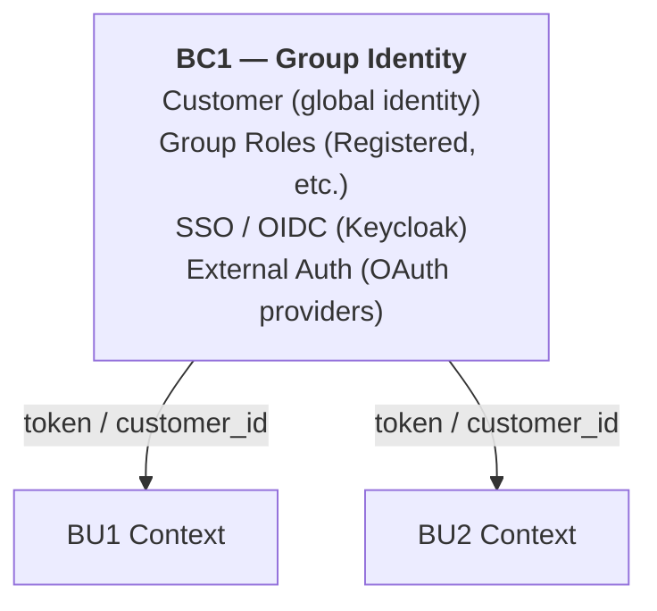
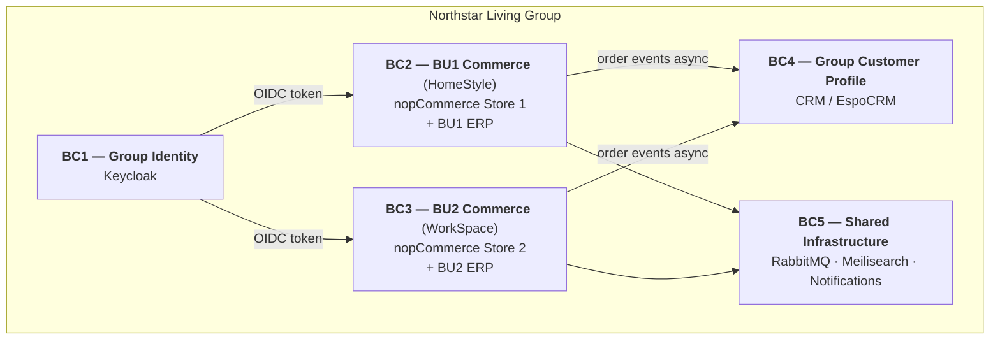

# Domain and Boundary Model

## Scenario Context

**Northstar Living Group** operates two or more business units (BUs) after acquisitions. For this assignment, we model two BUs explicitly:

- **BU1 — HomeStyle** (home décor, furniture, premium pricing, B2C)
- **BU2 — WorkSpace** (office supplies, B2B pricing, wholesale roles, volume discounts)

These two BUs share the Northstar group platform (nopCommerce) but have distinct operational identities.

## Subdomains

| Subdomain | Type | Description |
|---|---|---|
| **Identity & Access** | Shared Core | Who the customer is across the group; SSO and delegated access |
| **Catalog Management** | Supporting (per-BU) | Product definitions, attributes, categories — local to each BU |
| **Pricing** | Core (per-BU) | Price lists, discounts, tier rules — local to each BU |
| **Inventory** | Supporting (per-BU) | Stock levels, warehouse allocation — local to each BU |
| **Orders** | Core (per-BU) | Order lifecycle, workflows, fulfilment path — local to each BU |
| **Customer Profile** | Shared Core | Shared customer data across the group (purchase history, preferences) |
| **Notifications & Messaging** | Generic | Emails, reminders, campaigns — shared infrastructure |
| **Search & Discovery** | Generic | Product discovery, cross-BU search — shared infrastructure |
| **Configuration** | Supporting | Per-BU platform settings (theme, tax, shipping methods) |

## Bounded Contexts

### BC1 — Group Identity (Shared)
**Owner:** Northstar Group platform  
**Responsibility:** Authenticate users across all BUs; issue tokens; manage delegated access  
**Contents:** Customer identity, SSO (Keycloak), group-level roles (Registered, Guest)  
**External boundary:** Exposes OIDC tokens; BUs consume identity, do not own it  
**Does NOT contain:** BU-specific roles, BU customer preferences

### BC2 — BU1 Commerce (HomeStyle)
**Owner:** BU1 operational team  
**Responsibility:** Catalog, pricing, inventory, and orders for HomeStyle  
**Contents:** BU1 products, BU1 tier prices, BU1 warehouse stock, BU1 orders, BU1 roles (VIP, Trade)  
**External boundary:** Receives customer identity from BC1; publishes order events to BC4  
**Does NOT contain:** BU2 products, shared customer profile writes

### BC3 — BU2 Commerce (WorkSpace)
**Owner:** BU2 operational team  
**Responsibility:** Catalog, pricing, inventory, and orders for WorkSpace  
**Contents:** BU2 products, BU2 wholesale pricing, BU2 warehouse stock, BU2 orders, BU2 roles (Wholesale, B2B Account)  
**External boundary:** Receives customer identity from BC1; publishes order events to BC4  
**Does NOT contain:** BU1 products, shared customer profile writes

### BC4 — Group Customer Profile (Shared)
**Owner:** Northstar Group platform  
**Responsibility:** Aggregate customer activity across BUs for shared CRM view  
**Contents:** Purchase history (cross-BU), communication preferences, loyalty data  
**External boundary:** Consumes order events from BC2 and BC3; exposes read model to CRM  
**Does NOT contain:** Order management, BU-specific pricing

### BC5 — Shared Infrastructure
**Owner:** Group platform team  
**Responsibility:** Search indexing, messaging bus, notifications  
**Contents:** Search index (Meilisearch), message broker (RabbitMQ), email/notifications  
**External boundary:** BUs publish to and consume from this context

## Context Map

## Ownership of Major Responsibilities

| Responsibility | Owner | Mechanism |
|---|---|---|
| Customer authentication | BC1 (Group Identity) | OIDC via Keycloak; BUs are relying parties |
| Product catalog definition | BC2 or BC3 (each BU) | nopCommerce Store with mandatory StoreMapping |
| Product pricing | BC2 or BC3 (each BU) | BU-owned tier prices; no cross-BU price sharing |
| Inventory / stock levels | BC2 or BC3 (each BU) | BU-specific warehouse association |
| Order creation and lifecycle | BC2 or BC3 (each BU) | nopCommerce Order with StoreId enforced |
| Group-level order visibility | BC4 (Group Customer Profile) | Async event consumption from BU order events |
| Cross-BU product discovery | BC5 (Shared Infra) | Federated search index (Meilisearch) |
| Async coordination (reliability) | BC5 (Shared Infra) | RabbitMQ with retry / dead-letter handling |

## What Stays Inside the nopCommerce Monolith

| Component | Rationale |
|---|---|
| Order management (both BUs) | StoreId already enforces BU boundary; low extraction value |
| Settings and configuration | Per-store capability already solid; no need to extract |
| Payment processing | Plugin-based; BU-specific plugins sufficient |
| Shipping / tax calculation | Settings-scoped per store; plugin model sufficient |
| Authentication session | Delegated to Keycloak; nopCommerce consumes OIDC tokens |

## What Must Be Extracted or Federated

| Component | Where it goes | Reason |
|---|---|---|
| Customer identity | Keycloak (external) | nopCommerce identity is single-store; federation requires external IdP |
| Inventory / ERP per BU | ERPNext or Odoo per BU (external) | No BU-level warehouse isolation in nopCommerce |
| Customer profile aggregation | EspoCRM or equivalent (external) | Cross-BU view not supported natively |
| Event bus | RabbitMQ (external) | No native async coordination in nopCommerce |
| Search index | Meilisearch (external) | Cross-BU search requires unified index outside both stores |
