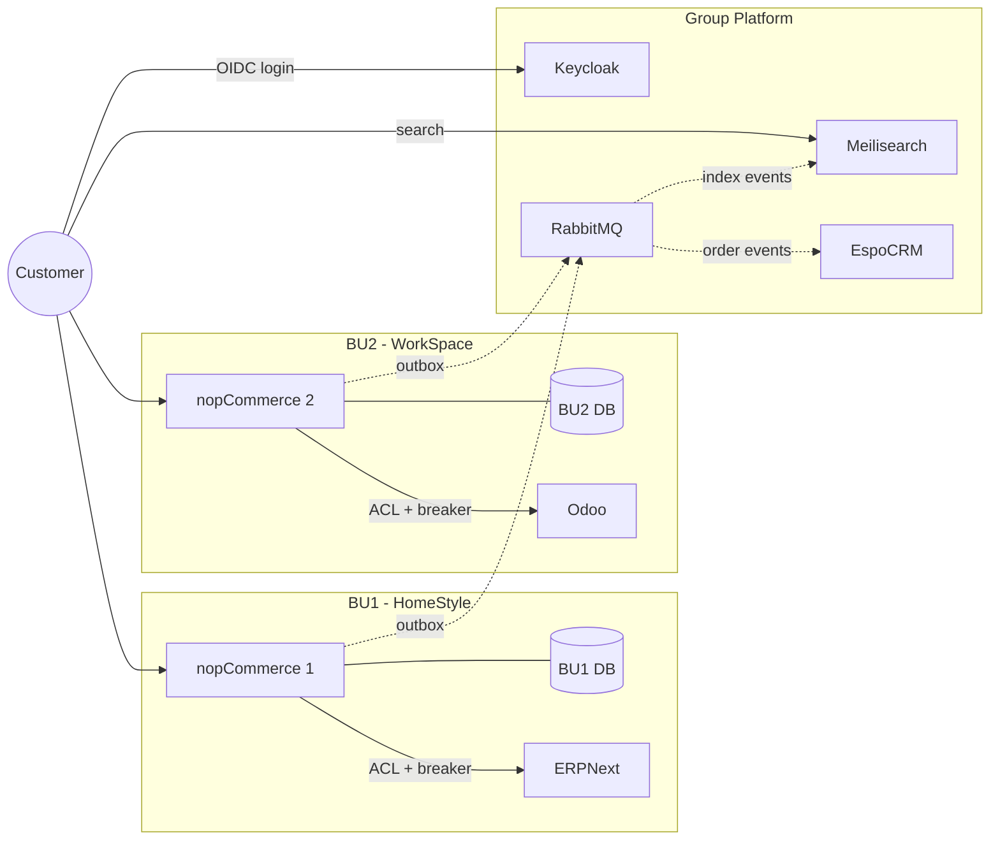

# Target Architecture

The target architecture is built by applying ADD (the framework chosen in doc 05) one iteration at a time. Each iteration takes a single quality-attribute driver from doc 04, refines one element of the system, selects design concepts that respond to the driver, and analyses what improved and what remains open.

## Inputs Carried Into Every Iteration

| Input type | Where it comes from |
|---|---|
| Business goals | doc 01 (Federated commerce, BU autonomy, group-level capability) |
| Quality scenarios | doc 04 (QA1–QA5) |
| Functional requirements | The two scenario use cases: cross-BU customer recognition + per-BU order placement |
| Constraints | nopCommerce remains the commerce core; no shared database across extracted boundaries; one independently deployable subsystem must be justified |
| Architectural concerns | Per-BU autonomy, failure containment, federated identity, async coordination |
| Existing architecture | doc 02 (onion architecture, opt-in multi-store, in-process `IEventPublisher`, no broker) |

---

## Iteration 1 - Federated Identity (driver: QA3)

**Iteration goal.** Recognise a customer across BUs without re-authentication, and apply BU-specific roles only inside that BU.

**Element refined.** The authentication seam in `Nop.Web.Framework`, currently delegated to `IAuthenticationService` and the `IExternalAuthenticationMethod` plugin manager.

**Design concepts selected.**

| Concept / tactic | Why it fits |
|---|---|
| **External Identity Provider (Keycloak)** | Customer identity becomes a shared asset; nopCommerce becomes a relying party rather than the source of truth |
| **OIDC / OAuth 2.0 standard contract** | Reuses the existing `IExternalAuthenticationMethod` slot; no protocol invention |
| **Group claims vs BU claims** | Group-level roles travel in the token; BU-local roles stay inside each nopCommerce instance |

**Decisions.** ADR-001 *Federate identity via Keycloak as external IdP*.

**Trade-off accepted.** Login latency now depends on Keycloak availability. Mitigated by short-lived tokens with refresh and a Keycloak HA pair.

**Analysis vs drivers.**

| Scenario | What improved | What remains open |
|---|---|---|
| QA3 | One identity, two BUs - no re-auth | Role-mapping rules between Keycloak groups and nopCommerce roles must be specified |
| QA1 | Identity outage no longer scoped to a single BU | Identity is now a group-level SPOF - needs HA |

---

## Iteration 2 - Fault Isolation Across BU ERPs (driver: QA1)

**Iteration goal.** A BU's local ERP failure must not cascade across the group. The affected BU degrades gracefully; other BUs and group services are untouched.

**Element refined.** The integration boundary between each nopCommerce instance and the BU's local ERP.

**Design concepts selected.**

| Concept / tactic | Why it fits |
|---|---|
| **Per-BU ERP** (ERPNext / Odoo, BU-local) | Removes the shared-warehouse pressure point P3; aligns ERP autonomy with BU autonomy |
| **Anti-corruption layer (ACL)** | Each BU ERP has its own model; ACL keeps the nopCommerce domain clean |
| **Circuit breaker** | Contains cascading failure when an ERP becomes slow or unreachable |
| **Cached stock snapshot + degraded-but-open mode** | Customers can still browse and add to cart; checkout shows "stock to be confirmed" instead of failing |

**Decisions.** ADR-003 *BU-local ERP behind an anti-corruption layer with circuit breaker*.

**Trade-off accepted.** Stock numbers can be stale during an ERP outage. Acceptable bound: 5 seconds detection, max 5 minutes stale before falling back to "to be confirmed" UX.

**Analysis vs drivers.**

| Scenario | What improved | What remains open |
|---|---|---|
| QA1 | BU2 ERP failure doesn't affect BU1; BU2 stays open in degraded mode | Reconciliation policy for "to be confirmed" orders after recovery |
| QA2 | Inventory ownership now genuinely BU-local | - |

---

## Iteration 3 - Cross-BU Async Coordination (driver: QA5)

**Iteration goal.** Orders placed in any BU must reach the group customer profile (BC4) within 30 seconds under normal conditions, and survive a CRM consumer outage of at least 24 hours without data loss.

**Element refined.** The event-publication path. Currently `IEventPublisher` is in-process only (doc 02 P4).

**Design concepts selected.**

| Concept / tactic | Why it fits |
|---|---|
| **Bridge `IEventPublisher` to RabbitMQ** | Reuse the existing publish points; swap the transport. No call-site churn |
| **Topic exchange per BU** | `bu1.order.placed`, `bu2.order.placed` - consumers subscribe by interest |
| **Durable queues + dead-letter** | Survive consumer downtime; bad messages don't poison the queue |
| **Idempotent consumer** (CRM upserts on `OrderId`) | Allows safe retries with no duplicates |
| **Outbox pattern at the publisher** | Guarantees exactly-once-from-publisher semantics: write order + outbox row in same DB transaction; relay drains to RabbitMQ |

**Decisions.** ADR-002 *Bridge `IEventPublisher` to RabbitMQ for cross-BU events with transactional outbox*.

**Trade-off accepted.** Eventual consistency between BU order and group profile. Acceptable per QA5 (≤30s normal, ≤24h under degradation).

**Analysis vs drivers.**

| Scenario | What improved | What remains open |
|---|---|---|
| QA5 | Order published reliably to broker; consumer outage survives | Backlog drain time after long outages must be bounded |
| QA4 | A reliable broker now also exists for search re-index events | - |

---

## Iteration 4 - Search Degradation and Recovery (driver: QA4)

**Iteration goal.** Both BU storefronts continue serving search results even when Meilisearch is unreachable, and resync automatically once it recovers.

**Element refined.** The product discovery path on each BU storefront, plus the indexing pipeline shared across BUs.

**Design concepts selected.**

| Concept / tactic | Why it fits |
|---|---|
| **External federated search index (Meilisearch)** | Cross-BU discovery requires a unified, BU-tagged index outside both stores |
| **Strategy pattern at the search service** | Switch between Meilisearch (primary) and direct DB search (fallback) at runtime |
| **Health probe + circuit breaker** | Decide when to fall back, decide when to come back |
| **Async re-index from RabbitMQ** | On recovery, the index drains pending `*.product.changed` events and resumes |

**Decisions.** ADR-004 *Federated Meilisearch with DB fallback strategy*.

**Trade-off accepted.** Fallback search is slower (≤5s vs sub-second). UI shows a "results may be limited" notice during fallback.

**Analysis vs drivers.**

| Scenario | What improved | What remains open |
|---|---|---|
| QA4 | Search outage degrades, doesn't fail; auto-resync after recovery | Index drift bound during long outages |

---

## Iteration 5 - BU Pricing Autonomy (driver: QA2)

**Iteration goal.** A BU's product manager updates pricing for that BU without redeployment, without coordination with other BUs, and without affecting them.

**Element refined.** The catalog and pricing seam inside each nopCommerce instance.

**Design concepts selected.**

| Concept / tactic | Why it fits |
|---|---|
| **Mandatory `StoreMapping` enforcement** | Closes pressure point P6 (`IgnoreStoreLimitations` bypass); every product is BU-scoped at the database level |
| **BU-owned `TierPrice` records** | The existing seam (`TierPrice.StoreId != 0`) becomes the canonical price for that BU |
| **Disable `IgnoreStoreLimitations` at startup** | Hard fence the safety mechanism off via configuration |

**Decisions.** ADR-005 *Mandatory `StoreMapping` and BU-scoped pricing*.

**Trade-off accepted.** Group-level price overrides become a deliberate operation (set on every BU explicitly), not a single global toggle. This is the desired behaviour.

**Analysis vs drivers.**

| Scenario | What improved | What remains open |
|---|---|---|
| QA2 | BU1 price update has zero effect on BU2 | Tooling for "create product in all BUs" workflows must be added in admin |

---

## Consolidated Target Architecture - Component View

Solid lines = synchronous calls. Dotted lines = asynchronous events.

### Reading the diagram

| Concern | Where it shows up |
|---|---|
| Federated identity (QA3, ADR-001) | Customer → Keycloak; both BUs trust the same IdP |
| Per-BU autonomy (QA2, ADR-005) | Each BU has its own nopCommerce + DB; nothing crosses between them directly |
| Fault isolation (QA1, ADR-003) | ERP calls go through ACL + breaker, contained within each BU |
| Cross-BU coordination (QA5, ADR-002) | Dotted lines: outbox → RabbitMQ → CRM (orders) and → Meilisearch (index) |
| Search degradation (QA4, ADR-004) | Customer → Meilisearch is the primary path; on failure, the storefront falls back to its own DB (the existing `C → NC1 / NC2` link) |

## Consolidated Target Architecture - Deployment View

| Subsystem | Deployable unit | Tech | Independently deployable? | Database |
|---|---|---|---|---|
| BU1 Commerce | nopCommerce + plugins (incl. OIDC + outbox) | ASP.NET Core 9 | yes | BU1 DB (Postgres) |
| BU2 Commerce | nopCommerce + plugins | ASP.NET Core 9 | yes | BU2 DB (Postgres) |
| BU1 ERP | ERPNext | Frappe / Python | yes | own DB |
| BU2 ERP | Odoo | Python | yes | own DB |
| Group Identity | Keycloak | JVM | yes | own DB |
| Group Search | Meilisearch | Rust | yes | own state |
| Event Bus | RabbitMQ | Erlang | yes | persistent queues on disk |
| Group Customer Profile | EspoCRM consumer | PHP | yes | own DB |

**No shared database** spans extracted boundaries. **Eight independently deployable subsystems** in total - one chosen as the architectural anchor for the demo: the **OIDC + outbox plug-in pair on nopCommerce**, since that is where the federation tension is most visible.

## Evolution Path From Current State

| Step | Change | Driver | Risk |
|---|---|---|---|
| 1 | Install Keycloak; build OIDC plug-in implementing `IExternalAuthenticationMethod`; flip storefront login | QA3 | Identity becomes group SPOF - mitigate with HA pair |
| 2 | Enforce mandatory `StoreMapping`; disable `IgnoreStoreLimitations` at startup | QA2 | One-time data-migration scan to assign every product to at least one store |
| 3 | Stand up RabbitMQ; add outbox table + relay; bridge `EntityInsertedEvent<Order>` to broker | QA5 | Outbox + idempotency must be correct or the whole bus is unreliable |
| 4 | Stand up EspoCRM; subscribe to `*.order.placed`; backfill historical orders from per-BU DBs | QA5 | Backfill volume |
| 5 | Stand up Meilisearch; index per BU with BU tag; switch storefront search to it with DB fallback | QA4 | Index drift during fallback |
| 6 | Per BU: stand up ERP (ERPNext / Odoo), add ACL + circuit breaker, swap stock reads | QA1 | ERP-side data model divergence - kept inside the ACL |

## How This Satisfies The Required Technical Shape

| Required (assignment brief) | Where it appears |
|---|---|
| At least one asynchronous workflow | Order → outbox → RabbitMQ → CRM (Iteration 3) |
| At least one explicit reliability decision | Circuit breaker on BU ERP integration (Iteration 2); search fallback strategy (Iteration 4) |
| At least two surrounding systems | Keycloak, RabbitMQ, Meilisearch, EspoCRM, ERPNext, Odoo (six) |
| At least one independently deployable subsystem, justified | OIDC plug-in pair anchors the federation, plus the outbox relay subsystem; both are independently deployable and justified by QA1/QA3/QA5 |
| No shared database across extracted boundaries | Each BU has its own DB; ERP, IdP, broker, search, CRM all hold separate state |

## What This Architecture Deliberately Does Not Do

- **Does not** introduce microservices inside nopCommerce. The pressure points P1, P2, P6, P7 are addressed by enforcing existing seams, not by extraction.
- **Does not** unify pricing across BUs. Group-level pricing is rejected in QA2.
- **Does not** add an API gateway. There is no cross-BU synchronous API surface - coordination is async via the broker.
- **Does not** change the in-process `IEventPublisher` contract. The broker is bridged at the transport layer, not at the call site (preserving doc 02's onion-architecture invariants).
