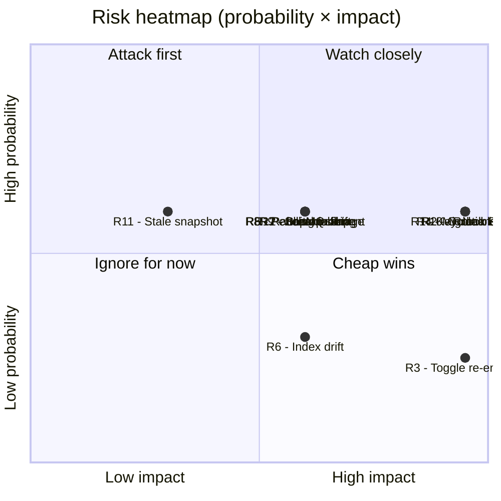

# Risk Plan and Feasibility Spike

This document satisfies the Part 1 deliverables "risk plan" and "feasibility spike" from the assignment brief.

## Risk Register

Risks are scored on a 1–3 scale for **probability** (P) and **impact** (I), with **score = P × I** (1–9). Risks with score ≥ 6 are treated as primary risks for Part 2 mitigation work.

| ID | Risk | P | I | Score | Trace |
|---|---|---|---|---|---|
| R1 | Keycloak becomes a group-wide login SPOF | 2 | 3 | 6 | ADR-001 |
| R2 | Outbox/idempotency bug causes duplicate or lost cross-BU order events | 2 | 3 | 6 | ADR-002, QA5 |
| R3 | `IgnoreStoreLimitations` re-enabled by an admin → silent group-wide isolation collapse | 1 | 3 | 3 | ADR-005, P6 |
| R4 | Customer migration to Keycloak loses or duplicates accounts at cutover | 2 | 3 | 6 | ADR-001 |
| R5 | RabbitMQ outage stalls the cross-BU pipeline | 2 | 2 | 4 | ADR-002 |
| R6 | Meilisearch index drift exceeds RabbitMQ retention window during long outage | 1 | 2 | 2 | ADR-004 |
| R7 | BU ERP circuit-breaker tuning produces flapping (open ↔ closed loop) | 2 | 2 | 4 | ADR-003 |
| R8 | Pending-fulfilment orders during ERP outage cannot be honoured at recovery | 2 | 2 | 4 | ADR-003 |
| R9 | Two BU teams diverge on product/category schema, breaking the federated search index | 2 | 2 | 4 | ADR-004 |
| R10 | Token-claim → BU-role mapping drifts between BUs, causing role bleed | 2 | 3 | 6 | ADR-001, QA3 |
| R11 | Grader runs an older nopCommerce snapshot lacking the Reminders feature, sees missing files cited in doc 02 | 2 | 1 | 2 | doc 02 fact-check |
| R12 | Demo environment cannot start all services (Keycloak + RabbitMQ + Meilisearch + 2× nopCommerce + 2× ERP + EspoCRM) on one laptop | 2 | 2 | 4 | Part 2 demo |

### Mitigations

| ID | Mitigation |
|---|---|
| R1 | Keycloak HA pair (primary + standby with shared DB); short-lived access tokens with refresh; storefront cookie-session continues to work for already-logged-in users until token expiry. |
| R2 | Transactional outbox (DB + outbox row in same TX); idempotent consumers keyed on `(aggregate_id, version)`; integration test that simulates relay crash mid-publish. |
| R3 | Remove the admin UI toggle for `IgnoreStoreLimitations`; pin to `false` at startup; refuse to start if found `true` in DB. |
| R4 | Cutover plan: link by email on first post-migration login; admin reconciliation tool for unmatched accounts; dry-run on a copy of production data. |
| R5 | Durable queues + persistent messages; outbox retains unpublished rows; relay backs off and resumes on reconnect; alerting on relay lag. |
| R6 | Bound retention to the largest tolerated outage (7 days); on longer outages, indexer rebuilds from per-BU DBs (slow path, runbook documented). |
| R7 | Use slow-start half-open with single probe; metrics dashboard for breaker state transitions; alert on flap rate. |
| R8 | Reconciliation policy: customer notified, refund or backorder offered; bounded by ERP cache TTL (≤5 min). |
| R9 | Indexer ACL normalises BU schemas into a single search document shape; integration test per BU mapping. |
| R10 | Single source of truth in Keycloak for the claim → role-prefix mapping table; checked into git; loaded at BU startup. |
| R11 | Doc 02 will be updated with a "code references against nopCommerce develop @ 2026-04-28 (post #7743 merge)" header. |
| R12 | Profiles in `docker-compose`: `core` (only nopCommerce + Keycloak + RabbitMQ), `full` (everything). Demo runs `core` with surrogates for ERP/CRM/Meilisearch when laptop resources are tight. |

### Risk Heatmap

The five risks in the **Attack first** quadrant (R1, R2, R4, R10 - and R3 with high impact at low probability) are the primary targets for the feasibility spike below and for Part 2 mitigation work.

## Feasibility Spike

The assignment requires "a feasibility spike" - a small, runnable proof that the highest-risk decision is actually viable on the existing codebase. Out of the four high-score risks, **R1 (Keycloak SPOF) + R10 (role mapping drift)** share a single root cause: the OIDC plug-in is the single most consequential new component, and we have not yet proven that nopCommerce will accept it cleanly through the existing `IExternalAuthenticationMethod` seam.

### Spike Goal

Prove, end-to-end on the local machine, that:

1. A nopCommerce storefront can redirect a guest user to Keycloak for login.
2. After successful authentication, nopCommerce receives an OIDC ID token and creates / matches a `Customer` record using the Keycloak `sub` claim.
3. Group-level claims from the token are mapped to local `CustomerRole` records on first login per BU.
4. A second nopCommerce instance (BU2) accepts the same Keycloak session without re-authentication.

### Spike Scope

| In scope | Out of scope |
|---|---|
| One Keycloak realm with two OIDC clients (BU1, BU2) | HA Keycloak pair |
| One `Nop.Plugin.ExternalAuth.Keycloak` plugin implementing `IExternalAuthenticationMethod` | Refresh-token rotation, token revocation propagation |
| Two nopCommerce instances in `docker-compose` with separate DBs (`StoreId=1`, `StoreId=2`) | Outbox, RabbitMQ, ERP, CRM, Meilisearch (deferred) |
| Single test customer registered in Keycloak | Customer migration from existing nopCommerce DB |
| Group claim `verified-customer` mapped to local role on each BU | BU-specific role bleed test (deferred to integration tests) |

### Acceptance Criteria

The spike succeeds if a tester, starting from `docker compose up`, can:

1. Browse to `http://bu1.localtest.me`, click "Login with Keycloak", complete login as `alice@example.com`, and land back on the BU1 storefront authenticated.
2. Browse to `http://bu2.localtest.me` in the same browser session, see no login prompt, and observe that `alice@example.com` is recognised as the active customer with the `verified-customer` role applied locally.
3. Inspect each BU's `Customer` table and confirm one row per BU keyed by Keycloak `sub`, with the local role mapping in `CustomerCustomerRoleMapping`.

### Effort Estimate

| Task | Estimate |
|---|---|
| Stand up Keycloak in docker-compose with two clients | 1 h |
| Plugin scaffold from `Nop.Plugin.ExternalAuth.Facebook` template | 2 h |
| OIDC code-flow handler (using `Microsoft.AspNetCore.Authentication.OpenIdConnect`) | 3 h |
| Claim → role mapping wiring | 2 h |
| Two-BU docker-compose + cross-domain cookie config | 2 h |
| End-to-end smoke test | 1 h |
| **Total** | **~11 h** (1.5 days for one engineer) |

### What the Spike Will Tell Us

| Outcome | Implication |
|---|---|
| Plug-in seam accepts OIDC cleanly | ADR-001 is feasible; proceed to Part 2 build |
| Cookie / session sharing across BU subdomains works | QA3 response time (≤ 2 s) achievable; SSO is real, not theatre |
| Claim mapping requires invasive nopCommerce changes | ADR-001 needs revision: either embrace a richer plug-in API or accept token-side role pre-mapping |
| Plug-in cannot be loaded at all in this nopCommerce version | ADR-001 is blocked; pivot to direct OIDC middleware in `Nop.Web.Framework` |

### Backup Spike (if R1 spike completes early)

A second, smaller spike for **R2 (Outbox bug)**: insert a `Setting` row inside an `IConsumer<EntityInsertedEvent<Order>>` plus an outbox-pattern row insert in the same DB transaction; relay reads and publishes to a local RabbitMQ; verify exactly-once delivery to a stub consumer under simulated relay crash. Estimate: 6 h.

## What This Risk Plan Does Not Cover

- Parallel team risks (resourcing, time-to-deadline) - handled outside the architecture document.
- Legal / compliance risks of Keycloak data residency - out of scope for the demo, would be a real production concern.
- Long-term operational cost of the eight subsystems - defers to Part 2 evidence pack.
