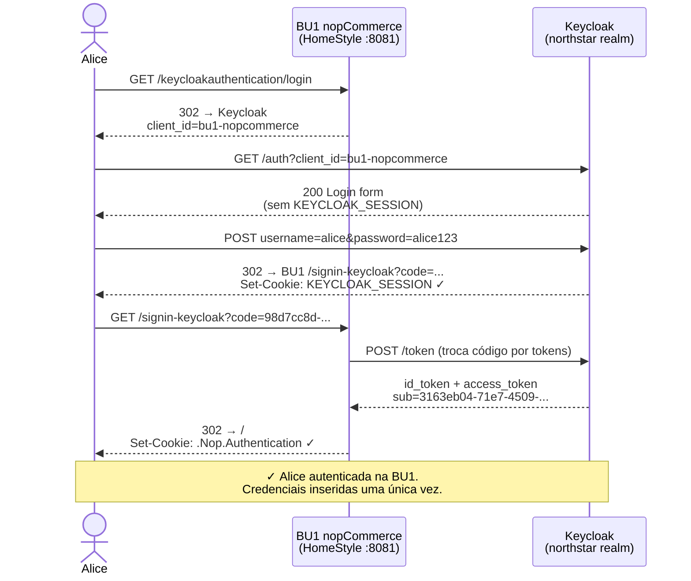
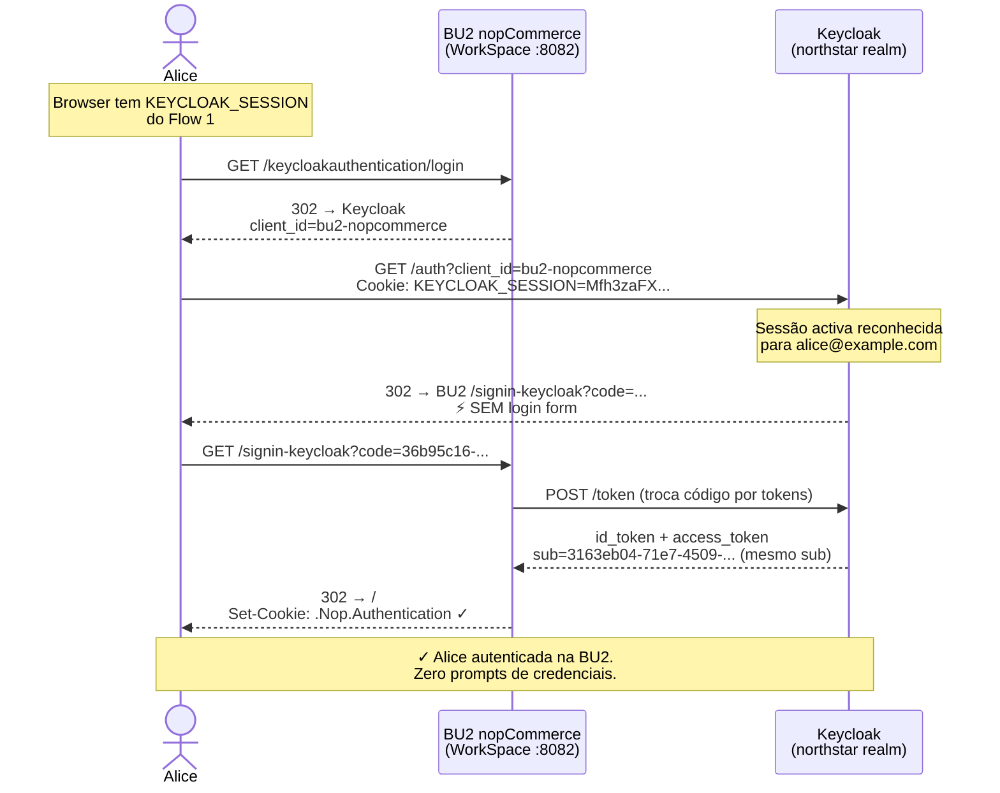
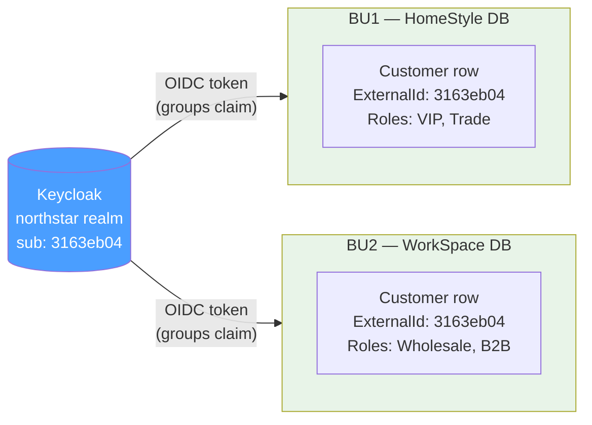

# ADR-002 — SSO Flow Sequence Diagram

## Flow 1 — Login inicial na BU1

---

## Flow 2 — SSO silencioso na BU2 (mesma sessão de browser)

---

## Prova de isolamento de roles

*Mesmo `sub` (ExternalIdentifier) nos dois BUs — identidade partilhada, roles locais independentes.*
